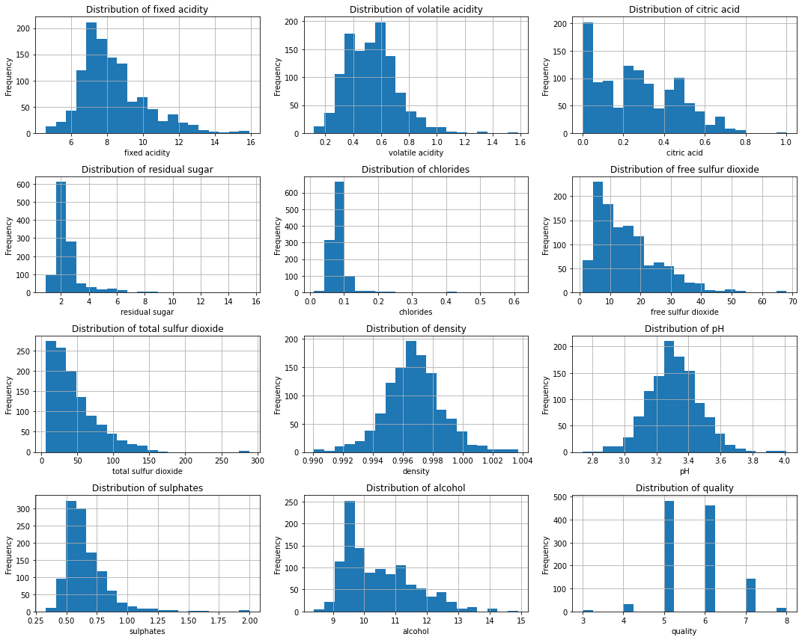
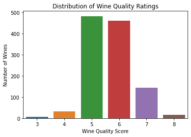
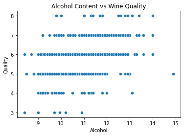
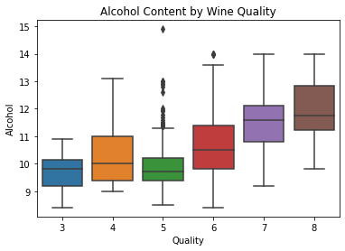
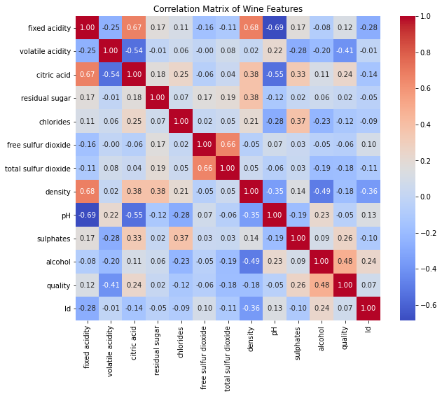

# PROJECT TITLE:PREDICTING AND ANALYZING WINE QUALITY

#  PROJECT OVERVIEW
This project focuses on analyzing a wine quality dataset to understand the relationship between various physicochemical properties and the resulting quality of red wine. The dataset includes 1,144 records and 13 attributes, such as fixed acidity, volatile acidity, citric acid, residual sugar, pH, alcohol content, and the quality rating.

By exploring and modeling this data, the goal is to gain insights into which chemical properties most strongly influence wine quality and to build a predictive model that can classify or score the quality of wine based on those properties. This type of analysis is valuable for wine producers and quality control teams aiming to improve product consistency and consumer satisfaction.

# PROBLEM STATEMENT
Wine quality is often judged by human tasters, which can be subjective, inconsistent, and costly. With increasing demand for quality control in wine production, there's a need for data-driven methods to assess wine quality based on measurable chemical properties.

The challenge lies in identifying the key features that affect wine quality and developing a predictive model that can reliably classify wine quality based on those features. Without such tools, producers risk inconsistent products and inefficient quality evaluation processes.

# DATA UNDERSTANGING
This dataset contains physicochemical properties of red wine samples, along with a quality score rated by wine tasters. Each row represents a unique wine sample, with measurements of various chemical components.

# ANALYSIS
## 1. Univariate Analysis:
**Alcohol** and **sulphates** have right-skewed distributions.

**Volatile acidity** tends to be higher in lower-quality wines.

**Quality** scores are mostly between 5 and 6.

## 2. Bivariate Analysis:
Wines with higher **alcohol** content generally have higher quality ratings.

Higher **sulphates** and lower **volatile acidity** are associated with better wine quality.

- A correlation heatmap showed strong relationships between some variables like:
  - `free sulfur dioxide` and `total sulfur dioxide`
  - `density` and `residual sugar`
  

# CONCLUSION
The wine quality is most influenced by **alcohol content**, **volatile acidity**, and **sulphates**.
- Wines with **higher alcohol** and **sulphates** but **lower volatile acidity** tend to be rated higher.
- Some chemical features such as **pH** and **residual sugar** showed weaker correlation with quality.

# RECOMMENDATIONS
**Wine producers** should focus on optimizing alcohol and sulphate levels to enhance quality.
- Maintain **low volatile acidity** during fermentation to avoid negative flavor impact.
- Additional data (e.g., grape type, region, storage conditions) could improve prediction accuracy.
- Consider using ensemble machine learning models for better performance in future work.
